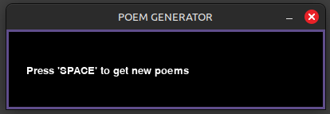
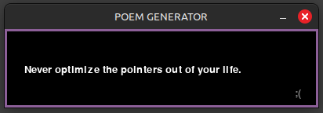
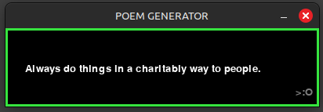
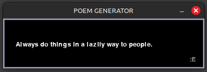

# Rhymming-and-Sayings

- A poem and saying generator built in Python with Pygame and NLTK.

This projects explores procedural content generation applied to text by using formal grammars.
Each phrase has "symbols" that may be changed to a word of the same grammatical class or another word that rhymes. Words are obtained from WordNet and CMUdict.

## Goal

- Generate small phrases that are funny and unique. (Do PCG)
- Use Formal Grammars in a project.
- Practice Python.

## Tools

- [Python] Main language
- [Pygame] Interface and controlls
- [NLTK] WordNet and CMUdict for words that rhyme and check grammatical classes

## How to Use

- Download "RhymmingAndSayings" and execute.
- Or execute main.py

## Status
- [FINISHED] 
- Maybe Future: Make a version that runs on browser.

